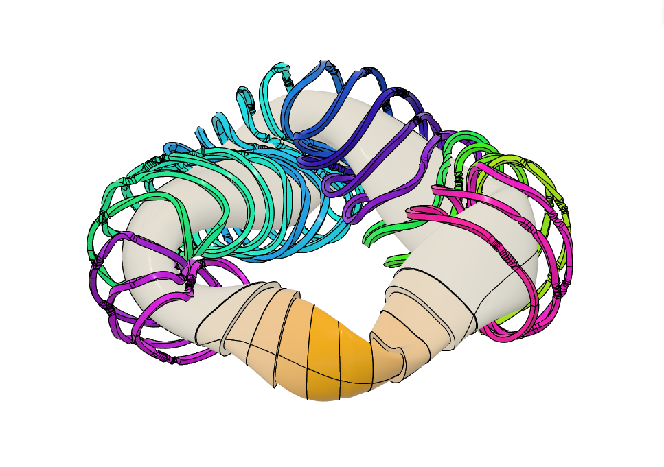
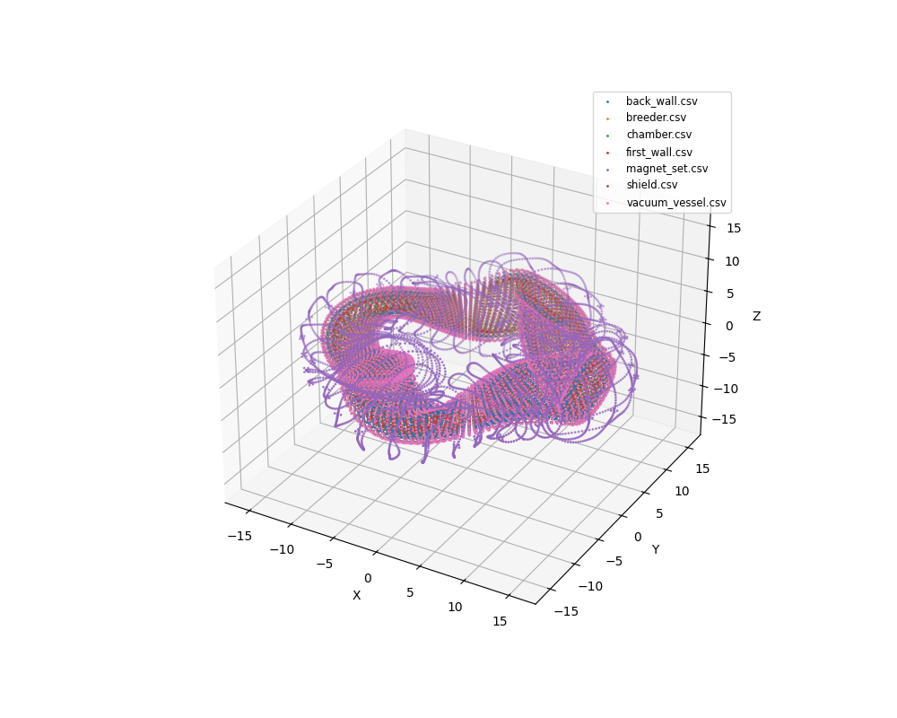

# alphastell

A Rust CAD generator for stellarator fusion reactors, built on top of OpenCASCADE (via [`cadrum`](https://github.com/lzpel/cadrum)) and inspired by [parastell](https://github.com/svalinn/parastell).



*Cutaway of the six in-vessel layers (chamber → vacuum vessel) with the 40-filament magnet coil set, produced by `make showcase`.*

## Overview

alphastell reads a [VMEC](https://princetonuniversity.github.io/STELLOPT/VMEC) magnetic equilibrium (`wout_*.nc`, NetCDF3) and produces solid CAD geometry for a full stellarator in-vessel build plus its modular coil assembly. It is intended as a small, fast, statically-linked companion tool for reactor-design studies — write a VMEC surface, get a STEP file you can drop into a CAD viewer or a neutronics pipeline.

Key outputs:

- **STEP** for CAD (`chamber`, `first_wall`, `breeder`, `back_wall`, `shield`, `vacuum_vessel`, `magnet_set`)
- **SVG** projected bird's-eye renderings for reports and docs
- **CSV** `x,y,z` point clouds for quick verification and plotting

One command reproduces the hero image above:

```bash
make showcase
```

points command for quick verification and plotting

```bash
make points
```



## Relationship to parastell

alphastell is a Rust reimplementation of the core in-vessel and magnet geometry generation from [parastell](https://github.com/svalinn/parastell) (Python, MIT, maintained by the [Svalinn](https://github.com/svalinn) group at UW-Madison). It borrows:

- the VMEC Fourier evaluation recipe for `R(θ, φ)` and `Z(θ, φ)`
- the six-layer material stack (first wall, breeder, back wall, shield, vacuum vessel) and the standard thicknesses (5 / 50 / 5 / 50 / 10 cm)
- the `wall_s = 1.08` offset convention and the `Planar` in-cross-section normal offset method
- the `coils.example` MAKEGRID format for magnet filaments

Differences: the kernel is Rust + OCCT (bundled statically through `cadrum`), outputs can be cross-checked with `validate` against reference parastell STEP files (vendored under `parastell/examples/alphastell_full/`), and boolean-subtract-based shell construction is used instead of `Shell::offset`.

The `parastell/` directory is a vendored snapshot (not a git submodule). All credit for the underlying approach goes to the parastell authors; bugs in the Rust port are mine.

## Subcommands

| Subcommand | Output | Purpose |
|---|---|---|
| `vessel`   | 6 × `.step` + `.csv` | 6-layer in-vessel build from a VMEC `wout_*.nc` |
| `magnet`   | `magnet_set.step` + `.csv` | Rectangular-cross-section sweep of 40 coil filaments |
| `plasma`   | `plasma_M*_N*.step` | Diagnostic: LCFS (s=1.0) at several (M, N) resolutions |
| `cut`      | 1 × `.step` | Sector-wedge boolean: `--cut` keeps the wedge, `--union` removes it |
| `compound` | merged `.step` + `.svg` | Merge multiple STEP inputs (optionally plus an in-memory magnet sector) with chamber→vacuum-vessel gradient coloring, and write a projected SVG |
| `validate` | stdout | Volume-ratio check (and optional boolean-Union volume) against a reference STEP |

Run `cargo run --release -- <subcommand> --help` for the full flag set.

## Getting started

```bash
git clone https://github.com/lzpel/alphastell
cd alphastell

cargo build --release

make run              # vessel + validate against the bundled parastell reference
make showcase         # reproduce figure/image.png as out/showcase.step + .svg
make points           # 3D scatter of every out/*.csv (needs `uv`)
```

Prerequisites: stable `rustc` with edition 2024 support, GNU `make`, and [`uv`](https://docs.astral.sh/uv/) for the Python viewer scripts under `tools/` (optional). OCCT is statically linked through the `cadrum` crate, so no separate install is required.

## Example usage

```bash
# 6 in-vessel layers (parastell default: wall_s=1.08, scale=100 → cm output)
cargo run --release -- vessel --input parastell/examples/wout_vmec.nc --output out/

# 40-coil magnet set
cargo run --release -- magnet --input parastell/examples/coils.example --output out/magnet_set.step

# Keep half the torus of first_wall (sector [-1/4, +1/4] of τ = [-90°, +90°])
cargo run --release -- cut --cut -i out/first_wall.step -o out/fw_half.step -s -1/4 -e 1/4

# Merge vessel layers + a magnet sector into one colored STEP + SVG
cargo run --release -- compound \
    -i out/chamber.step -i out/vacuum_vessel.step \
    --input-magnet parastell/examples/coils.example \
    -o out/merged.step
```

The `make showcase` target wires this together: each vessel layer is cut with a progressively wider window (`i · τ/36` half-span, i = 0..6), then all six layers and the `−τ/6..τ/6`-complementary coil set are compounded. Vessel layers get a linear RGB gradient from `#EE7800` (chamber) to `#FFFFFF` (vacuum vessel); coils keep their per-filament rainbow color from `magnet::build_sector`.

## Repository layout

```
src/             Rust source for each subcommand
tools/           Python viewers (view_points.py, etc.)
parastell/       Vendored parastell snapshot — reference algorithms and example data
parastell/examples/    wout_vmec.nc, coils.example, alphastell_full/*.step
figure/          Rendered showcase images
notes/           Design notes (Japanese)
examples/        Small cadrum usage examples (seam-dent repro etc.)
```

## Known limitations

- **[cadrum#120](https://github.com/lzpel/cadrum/issues/120)** — the periodic B-spline seam in `Solid::bspline(grid, periodic=true)` leaves mm-scale dents on chamber-like surfaces; the grid is deliberately kept at M=128, N=48 to keep the artifact small.
- **[cadrum#122](https://github.com/lzpel/cadrum/issues/122)** — round-tripping a multi-solid compound STEP (40 magnet coils) through `read_step` currently returns zero solids. `compound --input-magnet` bypasses this by building the coils in-memory.
- The STEP header declares `SI_UNIT(.MILLI., .METRE.)`, but `vessel --scale` defaults to cm. Viewers therefore render everything at 1/10 of the intended physical size. Relative dimensions are still correct.

## Contact

If any of this is useful to your group — or if you just want to compare notes on stellarator CAD / VMEC pipelines — feel free to reach out: [Satoshi Misumi on LinkedIn](https://www.linkedin.com/in/satoshi-misumi-b17261322/).

## License

Released under the MIT License — see [LICENSE](./LICENSE). The vendored `parastell/` tree keeps its upstream MIT license (`parastell/LICENSE.md`).
