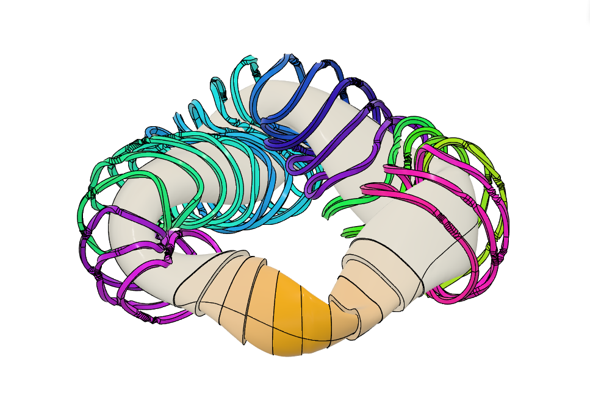

# alphastell

ステラレータ液体金属ブランケットの成立性を、VMEC 平衡(`wout.nc`)から分単位で判定するオープンソースパイプライン。

プラズマ境界を入力すると、磁気面に追従する液体金属流路を生成し、次の3つのプラント判定スカラーと設計図面を返す:

1. TBR(トリチウム増殖比) ≥ 1.1〜1.15 で燃料サイクルが閉じるか
2. MHD 総圧損 → ポンプ動力の対核融合出力比 液体金属ブランケットの生死を決める数字
3. 最高壁温度 / 構造材界面温度 材料寿命と腐食限界

## 進捗

成果物は GitHub Actions が [GitHub Pages](https://lzpel.github.io/alphastell/) に公開する。

### 実験05 `make al-05`

ブランケット流路の向きを (φ, θ) 平面の巻き数 (n_phi, n_theta) ひとつで表し、流路接線と磁力線の成す角の $\sin^2$ (MHD 圧損の代用指標) を比較。ポロイダル流路は全長で磁力線と直交 (指標 1.00)、トロイダルでも捻れのせいで 0.21 残る。

[レポート](https://lzpel.github.io/alphastell/al_05_blanket_3dplot.md) / [ポロイダル](https://lzpel.github.io/alphastell/al_05_blanket_3dplot.poloidal.png) / [ヘリカル](https://lzpel.github.io/alphastell/al_05_blanket_3dplot.helical.png)

### 実験06 `make al-06`

LCFS を法線方向に押し出した純 PbLi 殻 (30/50/70 cm) の TBR を OpenMC で計算。構造材・冷却材・遮蔽なしの上限値で、70 cm でも飽和しない — 厚みは常に正義、という基準線。

[レポート](https://lzpel.github.io/alphastell/al_06_pbli_tbr.md) / [殻の STEP](https://lzpel.github.io/alphastell/al_06_pbli_tbr.shell.step)

### 実験07 `make al-07`

一様点線源 (al_06 方式)・重み付き点線源・parastell 式四面体メッシュ線源を同じ PbLi 殻で比較。TBR は線源モデルをほぼ選ばないが、局所量は 20% 超ずれる。以降の局所量計算は重み付き点線源 (case_2) を採用。

[レポート](https://lzpel.github.io/alphastell/al_07_source_models.md)

### 実験08 `make al-08`

simsopt の stage-2 最適化でモジュラーコイルを起こし、コイル-プラズマ距離を走査。半径方向の予算は約 1.4 mとして中心線を nearest 射影 + LCFS 法線の guide 曲線で掃引し、40 × 50 cm の巻線パック実体も出す。

$$
(\mathbf p - \mathbf x) \cdot \partial_\phi \mathbf x = 0, \quad (\mathbf p - \mathbf x) \cdot \partial_\theta \mathbf x = 0
$$

nearest の停留条件: コイル点 $\mathbf p$ から磁気面上の点 $\mathbf x(\phi, \theta)$ への残差が両接ベクトルと直交 (= 法線に平行) なら $\mathbf x$ が最近点で、その法線を guide に使う。

$$
\int (\mathbf B \cdot \mathbf n)^2 / |\mathbf B|^2 \; dA \to 0
$$

simsopt の停留条件: LCFS 上の規格化法線磁場の面積積分を最小化し、0 に達すればコイルの作る磁場が磁気面を厳密に再現する ($\mathbf B \cdot \mathbf n = 0$)。

[レポート](https://lzpel.github.io/alphastell/al_08_coil_geometry.md) / [距離-誤差トレードオフ](https://lzpel.github.io/alphastell/al_08_coil_geometry.error.png)

### 実験09 `make al-09`

増殖材 50 cm だけを挟んだコイルの核発熱をコイル別タリーで計算。合計 94 MW、体積平均は DEMO TF コイル目標の約 1000 倍で、遮蔽必須を数字で確定。核融合出力は VMEC 平衡からの積分 (3.1 GW) で校正。

[レポート](https://lzpel.github.io/alphastell/al_09_coil_heating.md) / [コイル別発熱](https://lzpel.github.io/alphastell/al_09_coil_heating.percoil.png) / [導体 STEP](https://lzpel.github.io/alphastell/al_09_coil_heating.coils.step)

## Reference

- Lion, J., Anglès, J.-C., Bonauer, L., Bañón Navarro, A., Cadena Ceron, S. A., Davies, R., Drevlak, M., Foppiani, N., Geiger, J., Goodman, A., Guo, W., Guiraud, E., Hernández, F., Henneberg, S., Herrero, R., Höchter, J., Jelonnek, J., Jenko, F., Jorge, R., ... Xanthopoulos, P., & Zheng, M. (2025). Stellaris: A high-field quasi-isodynamic stellarator for a prototypical fusion power plant. Fusion Engineering and Design, 214, 114868. PDF[https://github.com/user-attachments/files/31101341/Lion2025_Stellaris_A_high-field_quasi-isodynamic_stellarator_for_a_prototypical_fusion_power_plant.pdf]
- Smolentsev, S., Morley, N. B., Abdou, M. A., & Malang, S. (2015).Dual-coolant lead–lithium (DCLL) blanket status and R&D needs. Fusion Engineering and Design, 100, 44–54. [PDF](https://bpb-us-w2.wpmucdn.com/research.seas.ucla.edu/dist/d/39/files/2019/08/FED-v100-Smolentsev-Dual_Coolant_Lead_Lithium_Blanket_Status2015.pdf)
	- カジュアルな解説：PbLiを流す流路の一つDCLLのレビュー論文　図が分かりやすい
- Martelli, E., Del Nevo, A., Arena, P., Bongiovì, G., Caruso, G., Di Maio, P. A., Eboli, M., Mariano, G., Marinari, R., Moro, F., Mozzillo, R., Giannetti, F., Di Gironimo, G., Tarallo, A., Tassone, A., & Villari, R. (2017). Advancements in DEMO WCLL breeding blanket design and integration [Preprint]. EUROfusion. [PDF](https://scipub.euro-fusion.org/wp-content/uploads/eurofusion/WPBBPR17_17326_submitted.pdf)
	- カジュアルな解説：PbLiをポンプで流さず溜池にするWCLLの論文 CAD図が分かりやすい

[parastell]: https://github.com/svalinn/parastell
[openmc]: https://github.com/openmc-dev/openmc
[cadrum]: https://github.com/lzpel/cadrum
